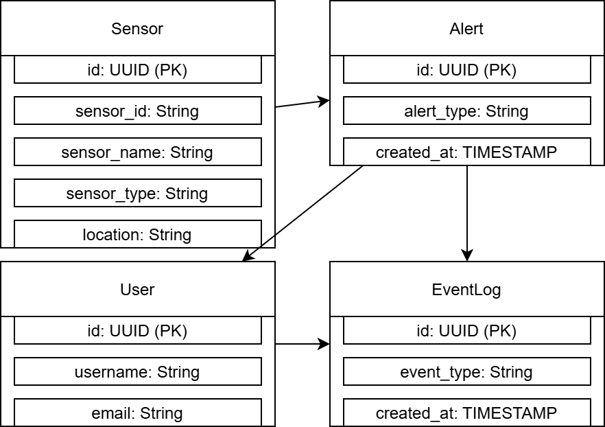

# Vivavis Demo MVP - Backend

This is a demonstration MVP (Minimum Viable Product) backend application developed using **Java Spring Boot**. It utilizes **Hexagonal Architecture**, which helps keep the business logic in the core, isolated from potential changes in external infrastructure. This design enhances modularity and makes the application easier to maintain. The application showcases a segment of a **Dispatcher Monitoring System** used in energy (water) supply networks.

## Key Features
- **Hexagonal Architecture**: Ensures the core business logic is independent of external technologies, such as databases, messaging systems, or user interfaces. This makes the system more adaptable to changes.
- **Backend for Dispatcher System**: A fragment of a monitoring system for energy (water) supply networks, with real-time event tracking and user management.
- **Dockerization**: The application can be containerized using Docker, enabling easy deployment both locally and in the cloud.
- **Environment Variables**: The application supports environment variables for configuration.

## Entity Relationship Diagram (ERD)

Below is the **YAML** schema of the entities involved in this application, taken from the `vivavis_scheme.xml` (located in the root directory of the project).



## How to Use

## API Endpoints
Please follow the order of entity creation as described below:

POST /api/alerts:

Example Request:

```json
{
    "alertType": "Critical",
    "createdAt": "2025-01-16T12:30:00",
    "sensors": []
}
```
This will create an alert. After this request, you will get an id for the alert.

POST /api/sensors:

Example Request:

```json
{
    "sensorId": "VS-12345",
    "sensorName": "Voltage Drop Sensor",
    "sensorType": "Voltage Drop",
    "location": "Power Grid - Substation A",
    "status": "active",
    "timestamp": "2025-01-16T12:30:00",
    "alert": {
        "id": "d832b0df-e8a2-4b0b-9a39-7b23e4663c1e"
    }
}
```
The "id" for the alert should be taken from the response of the POST /api/alerts request.

POST /api/events:

Example Request:

```json

{
    "eventType": "Voltage drop 10%",
    "createdAt": "2025-01-16T12:00:00",
    "sensor": {
        "id": "3d46df33-b671-4f9e-b992-fbaa30016ae3"
    }
}
```
The "id" for the sensor should be taken from the response of the POST /api/sensors request.

POST /api/users:

Example Request:

```json

{
    "username": "dispatcher_koblenz",
    "password": "securePassword123", 
    "email": "dispatcher@koblenz-grid.de",
    "role": "DISPATCHER"
}
```
This will create a new user in the system.